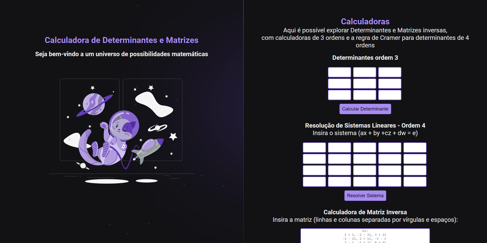

  

# Calculadora de Matrizes

Um projeto web para calcular determinantes, resolver sistemas lineares e calcular a matriz inversa.

## Tecnologias Utilizadas

- HTML
- CSS
- JavaScript (Math.js)

## Funcionalidades

- **Determinantes de Ordem 3:** Insira os valores em uma matriz 3x3 e calcule o determinante.
- **Resolução de Sistemas Lineares - Ordem 4:** Insira os coeficientes e termos independentes de um sistema linear 4x4 para resolver usando a regra de Cramer.
- **Calculadora de Matriz Inversa:** Insira uma matriz para calcular sua inversa.

## Como Usar

1. Clone o repositório.
2. Abra o arquivo `index.html` em um navegador web.
3. Insira os valores necessários nas respectivas calculadoras e clique no botão correspondente para obter o resultado.
